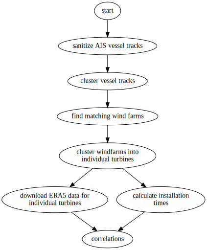

# I spy with my little eye, or: using satellite data to investigate performance of offshore wind farm installation campaigns

Offshore wind is rapidly becoming a major source of energy. With more than 5700 offshore wind turbines currently
operational, a significant amount of experience has been gathered by industries and nations alike. The wind turbines
currently being operated in the world's seas are, however, far from homogenous 

# How to use this repository

To ensure reproducibility, the complete chain of processing is available via a shell script (`run_analysis.sh`). 
To run the analysis from scratch, please run the following command in the base of this repository. Beware: 
this may take a considerable amount of time.

```bash
./run_analysis.sh --verbose
```

The corresponding paper will be build using latexmk in the subdirectory `manuscript`

# Analysis Flow Chart



# Data 

This section describes the types of data this project is concerned with, the structure of the data and the
relationships between the different data types. After a short overview, each data set is described in depth. 

Central to the project are tracks of offshore installation vessels, spanning several years, covering more than a
dozen offshore wind farm installations. These wind farms in turn form a second (meta) data set, as each offshore
wind farm consists of a different type of turbine, has a different location, a different number of turbines and 
a different layout. Finally, for each offshore wind farm installation campaign, metocean data, such as wind speed
and direction, wave height, wave direction and wave period, are compiled.

## Marine Traffic
Automatic Identification System (AIS) tracks of nine offshore wind farm installation vessels have been procured
from a data broker ([marinetraffic.com](https://marinetraffic.com)). 
A track refers to a collection of unique AIS records. Each record contains a unique time stamp and the vessels 
ID as well as latitude, longitude, speed, heading and the vessel's status. 
The vessel AIS tracks spread over several years and thus contain the port calls, sailing legs and of course 
offshore wind farm installation campaigns. 
Each vessel is identified by it's unique ID. There are several types of IDs available: IMO, MMSI, the vessels 
call sign and it's name. In this project, we use the MMSI ID in conjunction with the vessel's name to uniquely identify a vessel. 
Note, that the MMSI can change, if the  vessel is reflagged and that there several vessels can carry the same name. 

The following vessels and their respective tracks are available

| MMSI      | Name           | data availability |
| --------- | -------------- | ----------------- |
| 218389000 | Thor           | 2010 - 2021       |
| 218657000 | Vole au Vent   | 2013 - 2021       |
| 253355000 | Vole au Vent   | 2013 - 2021       |
| 219019002 | Sea Challenger | 2013 - 2021       |
| 229044000 | Brave Tern     | 2012 - 2021       |
| 229080000 | Bold Tern      | 2013 - 2021       |
| 235090598 | Blue Tern      | 2015 - 2021       |
| 215655000 | Blue Tern      | 2015 - 2021       |
| 245179000 | Aeolus         | 2010 - 2021       |
| 245924000 | MPI Adventure  | 2010 - 2021       |
| 246777000 | MPI Resolution | 2010 - 2021       |
| 253609000 | Taillevent     | 2010 - 2021       |
 
The raw vessel data as delivered by the data broker has been split into at least one csv file per year, 
e.g.: `2010.csv`. For some years, however, the data has been split into two files per year, e.g. `2012A.csv` and `2012B.csv`. 
The data files are structured into eight columns and as an example, the first three lines from the file `2010.csv` are shown:

```
MMSI;LAT;LON;SPEED;HEADING;COURSE;STATUS;TIMESTAMP
245924000;53.53467;0.284;81;511;303;0;2010-01-01 06:54:38.000
245924000;53.5505;0.1855;61;511;258;0;2010-01-01 07:25:38.000
```

`MMSI` is the ID of the vessel, `LAT` and `LON` correspond to the vessel's latitude and longitude, 
`SPEED` is the vessel speed in knots, `HEADING` the orientation of the vessel with respect to due North,
`COURSE` the vessels current planned direction of motion. `STATUS` is unknown and `TIMESTAMP` corresponds to the
date and time of the record in UTC.

The raw data can be found in the [data/marine-traffic/raw](data/marine-traffic/raw) directory.
[Data/marine-traffic/sanitized](data/marine-traffic/sanitized) contains the sanitized AIS tracks per vessel as 
csv files. These files span all available years for a given vessel and are organized into 7 columns. As an 
example the first three lines from `data/marine-traffic/sanitized/215644000_blue-tern.csv` are shown:

```
timestamp,epoch,latitude,longitude,speed,heading,course,status
2020-06-15 06:52:10+00:00,1592203930,53.45238,6.81926,0.0,287.0,132.0,5
2020-06-15 07:13:11+00:00,1592205191,53.45235,6.819262,0.0,287.0,132.0,5
```

## Wind Farms

Central to extracting offshore wind farm installations from vessel tracks is knowledge about the wind farms and their
corresponding installations. This required meta-data must include the wind farm name, location 
(latitude and longitude of wind farm's centroid), number and type of turbine, turbine manufacturer, installation 
beginning and end, type of foundation and installing companies. 
[Wikipedia](https://de.wikipedia.org/wiki/Liste_der_Offshore-Windparks) provides a non-exhaustive list of 
offshore wind farms per world region. The python script `get_windfarms_wikipedia.py` downloads the latest version
of the wikipedia tables, converts them into a machine readable format and saves the table as a csv in the [data directory](data/windfarms/windfarms.csv). 


## Metocean data (ERA5)

Wind and waves have a significant impact on offshore wind farm installations. Wind and waves cause forces, commonly
referred to as environmental loads, acting on the installation vessel, the crane and, of course, the wind turbine components 
undergoing installation. These loads in turn lead to adverse structural responses and may even cause
collisions between components when assembling turbines. Offshore wind farm installations are thus subject to 
wind and wave limits during installation operations. Different steps in the installation procedure can have
different limits. It is vital to understand though, that wind and wave limits are only a proxy to estimate the real 
limits, imposed by the structural response of the components being installed. 

Only a limited number of measurement stations are available world wide, hence, the usage of hind-cast models
has seen a increase in usage over the last years. These models incorporate real-world, sparsely-scattered measurements
into a numerical model of the sea and the atmosphere. Running these models then yields metocean data for any place 
on the earths surface with varying accuracy. 

A commonly used model is the model developed and provided by the European Union's European Centre of Medium-Range Weather Forecasts
(ECMWF). The data produced by ECMWF's numerical model is commonly referred to as
[ERA5](https://www.ecmwf.int/en/forecasts/datasets/reanalysis-datasets/era5) data. The ECMWF provides a volume-limited
API to download ERA5 data. A more thorough description of ERA5 data can be found 
[here](https://confluence.ecmwf.int/display/CKB/The+family+of+ERA5+datasets). ECMWF also provides a 
[python package](https://cds.climate.copernicus.eu/api-how-to) that can be used to request data. 
More information on how to access ERA5 data can be found [here](https://confluence.ecmwf.int/display/CKB/How+to+download+ERA5)

## Folder Structure

```
data
  installations
    installations.sqlite    # sqlite data base containing all successfully identified installations
    windfarm-name_vessel_start_end.csv    # installation data as csv
    ...
  marine-traffic  # contains AIS vessel tracks
    raw           # raw AIS data
      2010.csv
      2011.csv
      ...
    clean         # clean AIS data decomposed into per vessel time series
      215644000_blue-tern.csv
      218389000_thor.csv
      ...
    clustered     # clustered AIS vessel tracks
      215644000_blue-tern    # folder per vessel
        clusters
          215644000_blue-tern_cluster_0.csv
          215644000_blue-tern_cluster_1.csv
          215644000_blue-tern_cluster_2.csv
          ...
        windfarms
          windfarm_0
            215644000_blue-tern_windfarm_0.csv
            215644000_blue-tern_windfarm_0_turbine_0.csv    # AIS vessel tracks of single turbine 1
            215644000_blue-tern_windfarm_0_turbine_1.csv    # AIS vessel tracks of single turbine 2
            ...
          windfarm_1    # wind farm candidate 2
            215644000_blue-tern_windfarm_1.csv
            215644000_blue-tern_windfarm_1_turbine_0.csv
            215644000_blue-tern_windfarm_1_turbine_1.csv
            ...
          ...
      218389000_thor
        clusters
          cluster_0.csv
          cluster_1.csv
          cluster_2.csv
          ...
        windfarms
          windfarm_0
            218389000_thor_windfarm_0.csv
            218389000_thor_windfarm_0_turbine_0.csv
            218389000_thor_windfarm_0_turbine_1.csv
            ...
          windfarm_1
            218389000_thor_windfarm_1.csv
            218389000_thor_windfarm_1_turbine_0.csv
            218389000_thor_windfarm_1_turbine_1.csv
            ...

  metocean        # metocean data
    metocean-data.sqlite    # sqlite database listing available metocean data
    windfarm-name_coord-lat_coor-lon_start_end  # metocean record per wind farm 
  wind-farms      # wind farm data
    raw           # raw wind farm data from e.g. wikipedia
    clean         # clean wind farm data as csvs
    wind-farms.sqlite    # sqlite database containing all wind farm data
```

# Acknowledgements


