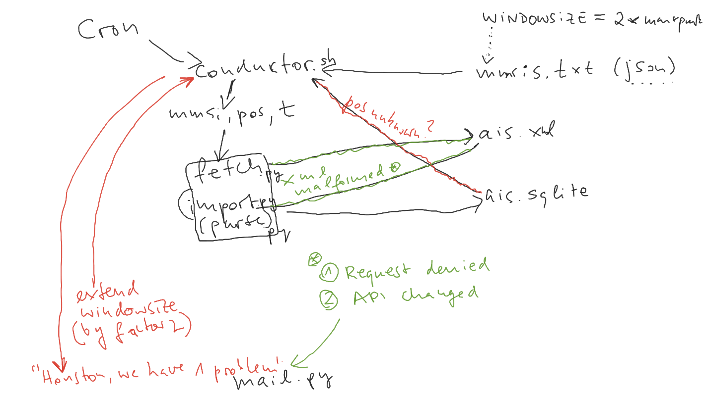

# 2021_WES_offshore-wind-installation

## Architecture

## ERA5 Data

ERA5 Data are data sets provided by ECWMF, containing hourly estimates of a vast number of atmospheric and oceaning parameters. A short description can be found [here](https://confluence.ecmwf.int/display/CKB/The+family+of+ERA5+datasets) (ECMWF -> European Center for Medium-range Weather Forecasts). 

The Data mostly stems from ESA's Copernicus program and access is possible through a web interface or the Climate Data Store (CDS) API.
CDS provides a [python package](https://cds.climate.copernicus.eu/api-how-to) that can be used to request data. More information on how to access ERA5 data can be found [here](https://confluence.ecmwf.int/display/CKB/How+to+download+ERA5)

